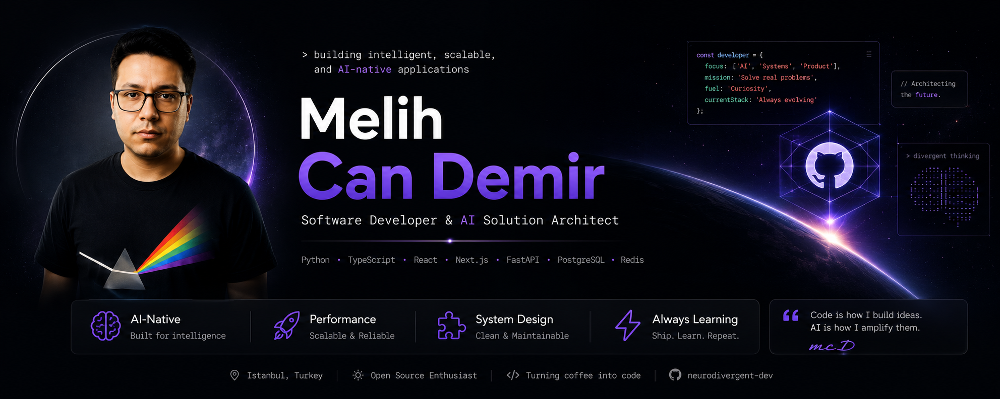

  

  Building intelligent, scalable, and AI-native applications. 
  I don't just write code; I architect systems that scale using SOLID principles and strict engineering standards.

---

## 🚀 Expertise & Delivery

Whether it's a cross-platform mobile app or a high-performance web platform, I handle the entire lifecycle—from pixel-perfect UI design to secure backend architecture. I deliver products at lightning speed with zero-compromise quality, utilizing **Agentic Orchestration** as my core development methodology.

### 🛠 Core Tech Stack
- **Development:** React Native (Expo), React.js, Next.js, Tauri (Rust) + Vite.
- **Backend & Cloud:** Supabase (PostgreSQL, Auth, Edge Functions), Firebase.
- **Tooling & DevOps:** TypeScript (Strict Mode), GitHub Actions, CircleCI, Vercel, Netlify.
- **Quality Assurance:** Jest (Unit/Integration), Maestro (E2E Mobile Testing).
- **Scale & UX:** i18next/Intlayer (25+ Languages), Lemon Squeezy/RevenueCat, Advanced 3D/Fluid Animations.

### 🤖 Advanced AI Orchestration
I specialize in building complex, autonomous systems:
- **Multi-Provider Orchestration:** Agnostic systems leveraging Gemini, Groq, OpenAI, and Claude to optimize speed, cost, and intelligence.
- **Agentic RAG:** Designing smart systems that reason and act upon retrieved data.
- **Context & Harness Engineering:** Building robust prompt architectures and safety layers for reliable AI agents.
- **BYOK Architecture:** "Bring Your Own Key" support for full cost control, model flexibility, and data privacy.

---

### 📱 Featured Apps
*   **[Mindbook Pro](https://mindbook.space)**                                                  — **Securely capture, organize, and protect your thoughts with an AI-native interface.**
*   **[Divergent AI](https://play.google.com/store/apps/details?id=com.metaframe.divergentai)** — **Break free from conventional thought patterns and unlock your unique creative potential.**
*   **[FocusTabs](https://play.google.com/store/apps/details?id=com.melihcandemir.focustabs)**  — **A minimalist, high-performance target management tool designed to boost productivity.**
*   **[Mindhouse](https://mindhouse.vercel.app/tr/landing)**                                    — **AI-powered platform for modern learning.**

## ✍️ Insights & Writing
*   [Developer Mode ON: Crafting an Expert-Level Prompt for AI-Augmented Engineering](https://medium.com/@melihcandemir/developer-mode-on-crafting-an-expert-level-prompt-for-ai-augmented-engineering-56a7e5a6754b)
*   [The Microservice Illusion in Small-Scale Startups: A Critical Examination of Architectural Choices](https://medium.com/@melihcandemir/the-microservice-illusion-in-small-scale-startups-a-critical-examination-of-architectural-choices-17f0aadc07a8)
*   [AI-Assisted Multi-Agent Orchestration Strategies](https://medium.com/@melihcandemir/ai-assisted-multi-agent-orchestration-strategies-dd537ab1b90c)
*   [Beyond Prompts: Building AI-Native Systems with Modular Reasoning](https://medium.com/@melihcandemir/beyond-prompts-building-ai-native-systems-with-modular-reasoning-and-recursive-architectures-e865a9282816)

---

  <em>“I don't just write code. I bring projects to life at lightning speed and with zero errors using Agentic Orchestration.”</em>

